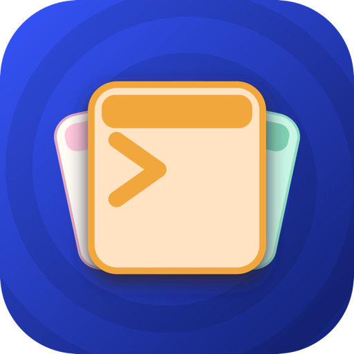

<table>
  <tr>
    <td></td>
    <td valign="middle">
      <h1>Tabs</h1>
      A fancy terminal for your Mac, with tabs, splits, and nested layouts —
      organize your shells however you like.
    </td>
  </tr>
</table>

## What is Tabs?

Tabs is a terminal app that replaces a cluttered desk of separate terminal windows.
Every pane can be split, put in a tab group, or nested inside another tab group, to
any depth — so your layout can look exactly like your work does, instead of the other
way around.

## Features

- **Split and nest freely** — divide any pane horizontally or vertically, group panes
  into tabs, and nest tab groups inside splits inside tabs, without limit.
- **Real terminals** — a genuine shell in every terminal pane, with true color and
  your usual dotfiles loaded, just like Terminal or iTerm.
- **Everything nests** — a tab can sit inside a split, inside another tab group,
  inside a floating window. Organize it however makes sense to you.
- **Keyboard-first navigation** — jump between panes and tabs, open new ones, and
  rearrange your layout without touching the mouse; shortcuts are rebindable in
  Settings.
- **Floating panes** — pop any pane out of the main window when you want it
  free-floating, and dock it back in whenever you like.
- **Light and dark themes** — the whole app follows your system appearance, or you
  can pick a theme explicitly.
- **AI agent friendly** — coding agents like Claude Code can open and drive their
  own panes without ever touching the panes you're using yourself.

## Installation

Tabs currently ships for **macOS on Apple Silicon** (M1 and later).

1. Go to the [Downloads page](https://github.com/hrusoft/downloads/tree/main/apps/tabs)
   and download the latest `.dmg`.
2. Open the downloaded file and drag **Tabs** into your **Applications** folder.
3. Launch Tabs from Applications (or Spotlight).

Tabs isn't notarized by Apple yet, so on first launch macOS will warn that it can't
verify the app. Right-click (or Control-click) the Tabs icon in Applications and choose
**Open**, then confirm **Open** in the dialog that appears — you only need to do this once.

## Contributing

Development happens in a private repository; this one is a mirror that receives a
squashed snapshot of the source with each release, which is why its history is one
commit per version rather than one per change.

Issues and pull requests are welcome here. A merged pull request is carried back into
the private repository with its authorship intact, and reappears in the next snapshot.

## License

Copyright © 2026 Hrusoft. All rights reserved.
