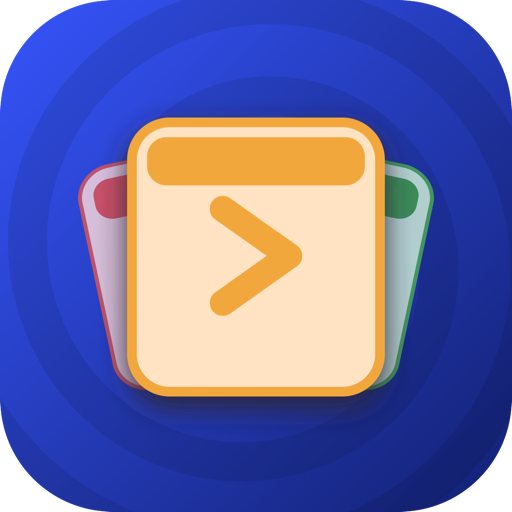

<table border="0">
  <tr>
    <td></td>
    <td valign="middle">
      <h1>Tabs</h1>
      A fancy terminal for your Mac, with tabs, splits, and nested layouts —
      organize your shells however you like.
    </td>
  </tr>
</table>

## What is Tabs?

Tabs is a terminal app that replaces a cluttered desk of separate terminal windows.
Every pane can be split, put in a tab group, or nested inside another tab group, to
any depth — so your layout can look exactly like your work does, instead of the other
way around.

## Features

- **Split and nest freely** — divide any pane horizontally or vertically, group panes
  into tabs, and nest tab groups inside splits inside tabs, without limit.
- **Real terminals** — a genuine shell in every terminal pane, with true color and
  your usual dotfiles loaded, just like Terminal or iTerm.
- **Everything nests** — a tab can sit inside a split, inside another tab group,
  inside a floating window. Organize it however makes sense to you.
- **Keyboard-first navigation** — jump between panes and tabs, open new ones, and
  rearrange your layout without touching the mouse; shortcuts are rebindable in
  Settings.
- **Browser panes** — open a web page in any pane, right beside the terminal
  running your dev server.
- **Git history** — a git tree pane draws a repository's commit graph, with each
  commit's changed files a click away.
- **Floating panes** — pop any pane out of the main window when you want it
  free-floating, and dock it back in whenever you like.
- **Light and dark themes** — the whole app follows your system appearance, or you
  can pick a theme explicitly.
- **AI agent friendly** — coding agents like Claude Code can open and drive their
  own panes without ever touching the panes you're using yourself.

## Installation

Tabs runs on **macOS 15 (Sequoia) or later**, on Apple Silicon and Intel Macs.

1. Go to the [latest release](https://github.com/hrusoft/tabs/releases/latest) and
   download `tabs-<version>-universal.dmg`. Each release lists its SHA-256 if you want
   to verify it.
2. Open the downloaded file and drag **Tabs** into your **Applications** folder.
3. Clear the quarantine flag once, from Terminal:

   ```sh
   xattr -rd com.apple.quarantine /Applications/Tabs.app
   ```

4. Launch Tabs from Applications (or Spotlight).

Tabs isn't signed or notarized by Apple yet, so macOS quarantines the downloaded copy and
refuses to open it until step 3 clears that flag. The `Read Me.txt` in the dmg says the
same.

## Building from source

Tabs is a Swift and AppKit app built with Xcode 27 and [mise](https://mise.jdx.dev):

```sh
make run      # build and launch with scratch data
make check    # everything a change must pass
```

[docs/DEVELOPMENT.md](docs/DEVELOPMENT.md) covers the rest: the commands, the layout of
the source, and the docs on how it all fits together.

## Contributing

Development happens in a private repository; this one is a mirror that receives a
squashed snapshot of the source with each release, which is why its history is one
commit per version rather than one per change.

Issues and pull requests are welcome here. A merged pull request is carried back into
the private repository by hand, with its authorship intact, and reappears in the next
snapshot — so please keep changes focused enough to port cleanly.

## License

Copyright © 2026 Hrusoft. All rights reserved.
